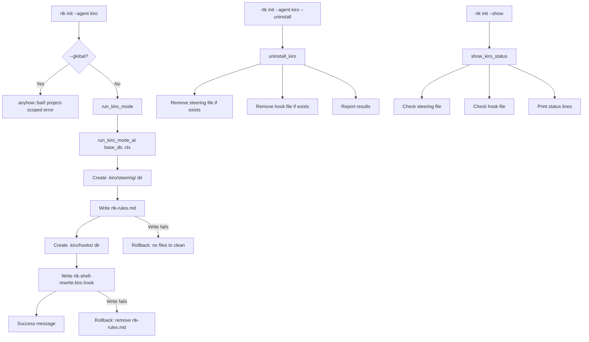

# Design Document: Kiro Agent Integration

## Overview

This design adds Kiro IDE as a supported agent target in RTK's `init` command. The integration follows the existing rules-file pattern (like Kilocode and Antigravity) but installs **two files** instead of one: a steering file with auto-inclusion frontmatter and a preToolUse hook file. The implementation is project-scoped, transactional (rollback on partial failure), and supports install, uninstall, show, and dry-run modes.

### Design Rationale

Kiro's architecture uses two complementary mechanisms for agent guidance:
1. **Steering files** (`.kiro/steering/`) — always loaded into context via `inclusion: auto` frontmatter
2. **Hooks** (`.kiro/hooks/`) — event-driven triggers that fire before tool execution

By installing both, RTK gets persistent context (steering) plus an active reminder at shell execution time (hook). This dual approach maximizes the chance the agent uses `rtk` prefixes without relying solely on prompt-level instructions.

## Architecture



## Components and Interfaces

### 1. AgentTarget Enum Extension

**File:** `src/main.rs`

Add `Kiro` variant to the existing `AgentTarget` enum:

```rust
#[derive(Debug, Clone, Copy, PartialEq, ValueEnum)]
pub enum AgentTarget {
    Claude,
    Cursor,
    Windsurf,
    Cline,
    Kilocode,
    Antigravity,
    Kiro,  // NEW
}
```

### 2. CLI Dispatch (src/main.rs)

Add routing in the `Init` command match arm, following the Kilocode/Antigravity pattern:

```rust
} else if agent == Some(AgentTarget::Kiro) {
    if global {
        anyhow::bail!("Kiro is project-scoped. Use: rtk init --agent kiro");
    }
    if uninstall {
        hooks::init::uninstall_kiro(ctx)?;
    } else {
        hooks::init::run_kiro_mode(ctx)?;
    }
}
```

### 3. Template Files

**Source location:** `hooks/kiro/`

| File | Embedded as | Target path |
|------|-------------|-------------|
| `hooks/kiro/rules.md` | `KIRO_STEERING` constant | `.kiro/steering/rtk-rules.md` |
| `hooks/kiro/hook.json` | `KIRO_HOOK` constant | `.kiro/hooks/rtk-shell-rewrite.kiro.hook` |

Both are embedded at compile time via `include_str!()`.

### 4. Installation Function

**File:** `src/hooks/init.rs`

```rust
const KIRO_STEERING: &str = include_str!("../../hooks/kiro/rules.md");
const KIRO_HOOK: &str = include_str!("../../hooks/kiro/hook.json");

pub fn run_kiro_mode(ctx: InitContext) -> Result<()> {
    run_kiro_mode_at(&std::env::current_dir()?, ctx)
}

pub fn run_kiro_mode_at(base_dir: &Path, ctx: InitContext) -> Result<()>;
```

**Behavior:**
1. Compute target paths relative to `base_dir`
2. Create `.kiro/steering/` directory if missing
3. Write steering file (overwrite if exists, skip if identical)
4. Create `.kiro/hooks/` directory if missing
5. Write hook file (overwrite if exists, skip if identical)
6. If hook write fails, roll back steering file
7. Print success summary

**Idempotency:** If both files already exist with identical content, print "already configured" and return success without writing.

**Transactional guarantee:** If the second file write fails after the first succeeds, the function removes the first file before propagating the error.

### 5. Uninstall Function

**File:** `src/hooks/init.rs`

```rust
pub fn uninstall_kiro(ctx: InitContext) -> Result<()>;
pub fn uninstall_kiro_at(base_dir: &Path, ctx: InitContext) -> Result<()>;
```

**Behavior:**
1. Attempt to remove `.kiro/steering/rtk-rules.md` — record if removed
2. Attempt to remove `.kiro/hooks/rtk-shell-rewrite.kiro.hook` — record if removed
3. If file doesn't exist, skip silently (no error)
4. Never remove directories (`.kiro/`, `.kiro/steering/`, `.kiro/hooks/`)
5. Print summary of removed files, or "no artifacts found" if nothing was removed

### 6. Show Config Integration

**File:** `src/hooks/init.rs`

Add Kiro status to the existing `show_config` flow:

```rust
fn show_kiro_status() {
    let steering = Path::new(".kiro/steering/rtk-rules.md");
    let hook = Path::new(".kiro/hooks/rtk-shell-rewrite.kiro.hook");
    
    let steering_ok = steering.exists();
    let hook_ok = hook.exists();
    
    match (steering_ok, hook_ok) {
        (true, true) => println!("[ok] Kiro: steering + hook installed"),
        (true, false) => println!("[warn] Kiro: steering installed, hook missing"),
        (false, true) => println!("[warn] Kiro: hook installed, steering missing"),
        (false, false) => println!("[--] Kiro: not configured"),
    }
}
```

### 7. Dry-Run Support

All file operations check `ctx.dry_run` before writing. In dry-run mode:
- Print `[dry-run] would create directory: .kiro/steering/`
- Print `[dry-run] would write: .kiro/steering/rtk-rules.md`
- Print `[dry-run] would write: .kiro/hooks/rtk-shell-rewrite.kiro.hook`
- If `ctx.verbose > 0`, also print file contents
- Call `print_dry_run_footer()` at the end

## Data Models

### Steering File Format (`.kiro/steering/rtk-rules.md`)

```markdown
---
inclusion: auto
---

# RTK - Rust Token Killer (Kiro)

**Usage**: Token-optimized CLI proxy for shell commands. Always use `rtk <cmd>` instead of raw commands to minimize token consumption (60-90% savings).

## Rule
[Instructions to prefix commands with rtk]

### Examples
[Fenced code blocks with rtk-prefixed commands]

## When NOT to use rtk
[Guidance on exceptions]

## Meta Commands
[rtk gain, discover, proxy]

## Why
[Explanation of token savings]
```

### Hook File Format (`.kiro/hooks/rtk-shell-rewrite.kiro.hook`)

```json
{
  "enabled": true,
  "name": "RTK Shell Rewrite Reminder",
  "description": "Before executing shell commands, reminds the agent to prefix commands with rtk for token-optimized output",
  "version": "1",
  "when": {
    "type": "preToolUse",
    "toolTypes": ["shell"]
  },
  "then": {
    "type": "askAgent",
    "prompt": "Before running this shell command, check: is it prefixed with 'rtk'? If not, and it's a supported command (git, cargo, ls, grep, find, read, docker, kubectl, aws, npm, pnpm, pytest, jest, vitest, go test, etc.), rewrite it to use 'rtk <original command>' for token-optimized output. Do NOT add rtk prefix to: interactive commands, rtk commands that are already prefixed, or commands that rtk doesn't support."
  }
}
```

### Constants

```rust
// File paths (relative to project root)
const KIRO_STEERING_DIR: &str = ".kiro/steering";
const KIRO_HOOKS_DIR: &str = ".kiro/hooks";
const KIRO_STEERING_FILE: &str = "rtk-rules.md";
const KIRO_HOOK_FILE: &str = "rtk-shell-rewrite.kiro.hook";
```

## Correctness Properties

*A property is a characteristic or behavior that should hold true across all valid executions of a system — essentially, a formal statement about what the system should do. Properties serve as the bridge between human-readable specifications and machine-verifiable correctness guarantees.*

### Property 1: Installation creates both files at correct relative paths

*For any* valid base directory path, running `run_kiro_mode_at(base_dir, ctx)` SHALL create exactly two files: `{base_dir}/.kiro/steering/rtk-rules.md` and `{base_dir}/.kiro/hooks/rtk-shell-rewrite.kiro.hook`, both with non-empty content matching their respective templates.

**Validates: Requirements 1.1, 2.1, 3.1**

### Property 2: Installation is idempotent

*For any* valid base directory, running `run_kiro_mode_at` twice in succession SHALL produce byte-for-byte identical file contents as running it once. The second invocation SHALL not error.

**Validates: Requirements 1.8, 5.1, 5.2, 5.3**

### Property 3: Uninstall removes exactly the RTK files

*For any* base directory where one or both RTK Kiro files exist, running `uninstall_kiro_at(base_dir, ctx)` SHALL result in neither `.kiro/steering/rtk-rules.md` nor `.kiro/hooks/rtk-shell-rewrite.kiro.hook` existing afterward, and SHALL return Ok(()).

**Validates: Requirements 4.1, 4.2, 4.3**

### Property 4: Uninstall preserves non-RTK directory contents

*For any* base directory containing additional files in `.kiro/steering/` or `.kiro/hooks/` beyond the RTK artifacts, running `uninstall_kiro_at` SHALL leave those other files and the directories themselves intact.

**Validates: Requirements 4.6**

### Property 5: Transactional rollback on partial failure

*For any* scenario where the steering file write succeeds but the hook file write fails, the resulting filesystem state SHALL contain neither the steering file nor the hook file — the operation leaves no partial artifacts.

**Validates: Requirements 10.3**

## Error Handling

| Scenario | Behavior |
|----------|----------|
| `--global` flag with `--agent kiro` | `anyhow::bail!("Kiro is project-scoped. Use: rtk init --agent kiro")` |
| Directory creation fails (permissions) | Return error with path and "Failed to create {dir}" context |
| Steering file write fails | Return error with path context, no cleanup needed (nothing written yet) |
| Hook file write fails | Remove steering file (rollback), then return error with path context |
| Rollback itself fails | Return error listing both the original failure and the cleanup failure |
| Uninstall on missing files | Skip silently, report "no artifacts found" if both missing |
| File read fails during idempotency check | Treat as "not identical" and proceed with overwrite |

### Error Message Format

Following existing patterns in the codebase:
```rust
fs::create_dir_all(&steering_dir)
    .context("Failed to create .kiro/steering directory")?;
fs::write(&steering_path, KIRO_STEERING)
    .context("Failed to write .kiro/steering/rtk-rules.md")?;
```

## Testing Strategy

### Property-Based Tests

The feature is suitable for property-based testing because:
- The init/uninstall functions are pure filesystem operations with clear input (base directory path) and output (file existence/content)
- Behavior varies meaningfully with input (different base paths, different initial states)
- Universal properties (idempotence, transactional rollback) hold across all valid inputs

**Library:** Use the `proptest` crate for Rust property-based testing.

**Configuration:** Minimum 100 iterations per property test.

**Tag format:** `// Feature: kiro-agent-integration, Property {N}: {description}`

Each correctness property maps to a single property-based test:

1. **Property 1 test:** Generate random temp directories, run init, assert both files exist with correct content
2. **Property 2 test:** Generate random temp directories, run init twice, assert file contents are identical
3. **Property 3 test:** Generate random initial states (files present/absent), run uninstall, assert RTK files are gone
4. **Property 4 test:** Generate random additional files in .kiro subdirs, run uninstall, assert those files survive
5. **Property 5 test:** Use a test harness that injects write failure on the second file, verify first file is cleaned up

### Unit Tests (Example-Based)

| Test | Validates |
|------|-----------|
| `test_kiro_mode_creates_steering_file` | Req 1.1 — file exists with correct content |
| `test_kiro_mode_creates_hook_file` | Req 2.1 — file exists with valid JSON |
| `test_kiro_hook_has_correct_schema` | Req 2.2-2.6 — JSON fields match spec |
| `test_kiro_steering_has_frontmatter` | Req 1.2 — YAML frontmatter present |
| `test_kiro_steering_has_examples` | Req 1.4 — at least 6 command examples |
| `test_kiro_global_rejected` | Req 1.9, 3.2 — error on --global |
| `test_kiro_uninstall_missing_files` | Req 4.3, 4.5 — no error when files absent |
| `test_kiro_uninstall_removes_files` | Req 4.1, 4.2 — files removed |
| `test_kiro_show_status_both_present` | Req 6.3 — [ok] status |
| `test_kiro_show_status_partial` | Req 6.3 — [warn] status |
| `test_kiro_show_status_none` | Req 6.3 — [--] status |
| `test_kiro_dry_run_no_writes` | Dry-run prints but doesn't write |

### Integration Tests

| Test | Validates |
|------|-----------|
| Windows path handling with spaces | Req 9.5 |
| Full install → show → uninstall cycle | Req 1-4 end-to-end |

### Test Pattern (following existing codebase)

```rust
#[test]
fn test_kiro_mode_creates_files() {
    let temp = TempDir::new().unwrap();
    run_kiro_mode_at(temp.path(), InitContext::default()).unwrap();

    let steering = temp.path().join(".kiro/steering/rtk-rules.md");
    let hook = temp.path().join(".kiro/hooks/rtk-shell-rewrite.kiro.hook");
    assert!(steering.exists());
    assert!(hook.exists());
}
```
